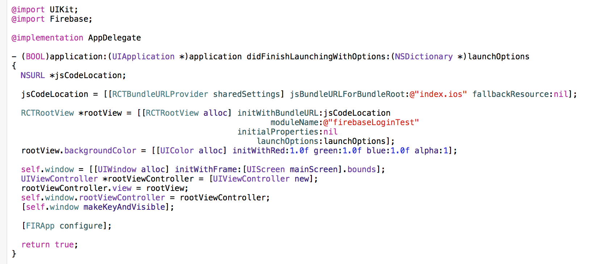
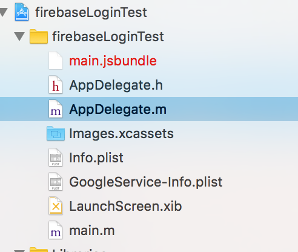
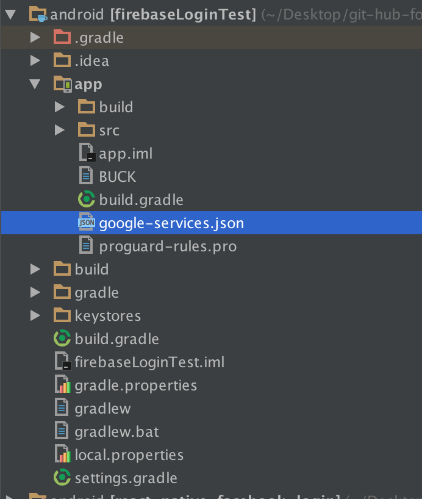

# How to add Firebase Auth with react native

If you want to add only what is supported with firebase-js-sdk such as auth and realtime-database, READ [THIS](https://medium.com/@jamesmarino/getting-started-with-react-native-and-firebase-ab1f396db549#.lpv5bwtwj)

AND If you want more feature, Read my Post Or Read [THIS](https://www.fullstackreact.com/articles/announcing-firestack-for-firebase/)

## iOS

### firebase Setup
Go firebase console and add iOS
Read [this](https://firebase.google.com/docs/ios/setup)

so your `AppDelegate.m` is



and your file tree is



you use [react-native-firestack](https://github.com/fullstackreact/react-native-firestack).
I send my PR, but if you want google Login, Facebook Login, and getToken Method right now, 
use my repository [https://github.com/g6ling/react-native-firestack](https://github.com/g6ling/react-native-firestack).

read README.md, and follow the step.
#### add Email Login

```js
import Firestack from 'react-native-firestack'

class firebaseLoginTest extends Component {
  componentWillMount(){
    var config = {
      apiKey: "your api key",
    };
    this.firestack = new Firestack(config);
    this.firestack.configure()
      .then(() => console.log("Project configured and ready to boot"));
  }
  _create(){
    this.firestack.createUserWithEmail(this.state.email, this.state.pw)
      .then((user)=>{
        console.log(user)
      })
      .catch((err)=>{
        console.log(err)
      })
  }
  _signin(){
    console.log(this.state.email)
    console.log(this.state.pw)
    this.firestack.signInWithEmail(this.state.email, this.state.pw)
      .then((user)=>{
        console.log(user)
        // if you want get user token 
        // add this.
        this.firestack.getToken()
          .then((result)=>{
            console.log(result)
          })
      })
      .catch((err)=>{
        console.log(err)
      })
  }

  render() {
    return (
      <View style={styles.container}>
        <Text>
        Email
        </Text>
        <TextInput
        onChangeText={(email)=>{this.setState({email: email})}}
        style={{height: 50, width: 200, backgroundColor: '#aaa'}}/>
        <Text>
        PW
        </Text>
        <TextInput
        onChangeText={(pw)=>{this.setState({pw: pw})}}
        style={{height: 50, width: 200, backgroundColor: '#aaa'}}/>
        <TouchableHighlight
          onPress={this._create.bind(this)}>
          <Text>create</Text>
        </TouchableHighlight>
        <TouchableHighlight
          onPress={this._signin.bind(this)}>
          <Text>signin</Text>
        </TouchableHighlight>
      </View>
    );
  }
}
```

#### add Facebook Login

we use [react-native-facebook-login](https://github.com/magus/react-native-facebook-login)

follow setup. follow [facebook-sdk setup](https://github.com/magus/react-native-facebook-login#facebook-sdk) and 
`npm install --save react-native-facebook-login`, you can use `rnpm link`.

if you meet error such as `"std::terminate()", referenced from: ___clang_call_terminate in libReact.a(RCTJSCExecutor.o)`
read this [post](https://github.com/facebook/react-native/issues/7566#issuecomment-219226634)

```js
var {FBLogin, FBLoginManager} = require('react-native-facebook-login');

class firebaseLoginTest extends Component {
  componentWillMount(){
    var config = {
      apiKey: "your-api-key",
    };
    this.firestack = new Firestack(config);
    this.firestack.configure()
      .then(() => console.log("Project configured and ready to boot"));
    
  })

  }
  _create(){
    this.firestack.createUserWithEmail(this.state.email, this.state.pw)
      .then((user)=>{
        console.log(user)
      })
      .catch((err)=>{
        console.log(err)
      })
  }
  _signin(){
    console.log(this.state.email)
    console.log(this.state.pw)
    this.firestack.signInWithEmail(this.state.email, this.state.pw)
      .then((user)=>{
        console.log(user)
        this.firestack.getToken()
          .then((result)=>{
            console.log(result)
          })
      })
      .catch((err)=>{
        console.log(err)
      })
  }

  
  _facebookLogin(data) {
    console.log("Logged in!");
    console.log(data);
    let token = data.credentials.token
    this.firestack.signInWithProvider('facebook', token, '')
      .then((user)=>{
        console.log(user)
        this.firestack.getToken()
          .then((result)=>{
            console.log(result)
          })
      })
  }
  render() {
    return (
      <View style={styles.container}>
        <Text>
        Email
        </Text>
        <TextInput
        onChangeText={(email)=>{this.setState({email: email})}}
        style={{height: 50, width: 200, backgroundColor: '#aaa'}}/>
        <Text>
        PW
        </Text>
        <TextInput
        onChangeText={(pw)=>{this.setState({pw: pw})}}
        style={{height: 50, width: 200, backgroundColor: '#aaa'}}/>
        <TouchableHighlight
          onPress={this._create.bind(this)}>
          <Text>create</Text>
        </TouchableHighlight>
        <TouchableHighlight
          onPress={this._signin.bind(this)}>
          <Text>signin</Text>
        </TouchableHighlight>
        <FBLogin
          permissions={["email","user_friends"]}
          loginBehavior={FBLoginManager.LoginBehaviors.Native}
          onLogin={this._facebookLogin.bind(this)}
        />
      </View>
    );
  }
}
``` 

#### add Google login

we use [react-native-google-signin](https://github.com/devfd/react-native-google-signin)

follow [setup](https://github.com/devfd/react-native-google-signin/blob/master/ios-guide.md)

if you want both facebook-login and google-login, edit AppDelegate.m

```objective-can
#import "AppDelegate.h"

#import "RCTBundleURLProvider.h"
#import "RCTRootView.h"

#import <FBSDKCoreKit/FBSDKCoreKit.h>
#import <FBSDKLoginKit/FBSDKLoginKit.h>

// add this line before @implementation AppDelegate
#import "RNGoogleSignin.h"

@import UIKit;
@import Firebase;

@implementation AppDelegate

- (BOOL)application:(UIApplication *)application didFinishLaunchingWithOptions:(NSDictionary *)launchOptions
{
  NSURL *jsCodeLocation;

  jsCodeLocation = [[RCTBundleURLProvider sharedSettings] jsBundleURLForBundleRoot:@"index.ios" fallbackResource:nil];

  RCTRootView *rootView = [[RCTRootView alloc] initWithBundleURL:jsCodeLocation
                                                      moduleName:@"firebaseLoginTest"
                                               initialProperties:nil
                                                   launchOptions:launchOptions];
  rootView.backgroundColor = [[UIColor alloc] initWithRed:1.0f green:1.0f blue:1.0f alpha:1];

  self.window = [[UIWindow alloc] initWithFrame:[UIScreen mainScreen].bounds];
  UIViewController *rootViewController = [UIViewController new];
  rootViewController.view = rootView;
  self.window.rootViewController = rootViewController;
  [self.window makeKeyAndVisible];
  
  [FIRApp configure];
  
  return [[FBSDKApplicationDelegate sharedInstance] application:application
                                  didFinishLaunchingWithOptions:launchOptions];
}

// Facebook SDK
- (void)applicationDidBecomeActive:(UIApplication *)application {
  [FBSDKAppEvents activateApp];
}

// change this.
- (BOOL)application:(UIApplication *)application
            openURL:(NSURL *)url
  sourceApplication:(NSString *)sourceApplication
         annotation:(id)annotation {
  return [[FBSDKApplicationDelegate sharedInstance] application:application
                                                        openURL:url
                                              sourceApplication:sourceApplication
                                                     annotation:annotation] ||
        [RNGoogleSignin application:application openURL:url
                                      sourceApplication:sourceApplication
                                             annotation:annotation];;
}


@end
```

```
import Firestack from 'react-native-firestack'
var {FBLogin, FBLoginManager} = require('react-native-facebook-login');
import {GoogleSignin, GoogleSigninButton} from 'react-native-google-signin';


class firebaseLoginTest extends Component {
  componentWillMount(){
    GoogleSignin.hasPlayServices({ autoResolve: true }).then(() => {
    // play services are available. can now configure library
      var config = {} // add your config.
      this.firestack = new Firestack(config);
      this.firestack.configure()
        .then(() => console.log("Project configured and ready to boot"));
      GoogleSignin.configure({
          iosClientId: "", // add your iosClientId. see your google-service.json
        })
        .then(()=>{

        });
    })
    .catch((err) => {
      console.log("Play services error", err.code, err.message);
    })

  }
  _create(){
    this.firestack.createUserWithEmail(this.state.email, this.state.pw)
      .then((user)=>{
        console.log(user)
      })
      .catch((err)=>{
        console.log(err)
      })
  }
  _signin(){
    console.log(this.state.email)
    console.log(this.state.pw)
    this.firestack.signInWithEmail(this.state.email, this.state.pw)
      .then((user)=>{
        console.log(user)
        this.firestack.getToken()
          .then((result)=>{
            console.log(result)
          })
      })
      .catch((err)=>{
        console.log(err)
      })
  }

  _googleLogin() {
    GoogleSignin.signIn()
      .then((user) => {
        console.log(user);
        this.firestack.signInWithProvider('google', user.idToken, user.accessToken)
          .then((user)=> {
            console.log(user)
          })
          .catch((err)=>{
            console.log(err)
          })
      })
      .catch((err) => {
        console.log('WRONG SIGNIN', err);
      })
      .done();
  }
  _facebookLogin(data) {
    console.log("Logged in!");
    console.log(data);
    let token = data.credentials.token
    this.firestack.signInWithProvider('facebook', token, '')
      .then((user)=>{
        console.log(user)
        this.firestack.getToken()
          .then((result)=>{
            console.log(result)
          })
      })
  }
  render() {
    return (
      <View style={styles.container}>
        <Text>
        Email
        </Text>
        <TextInput
        onChangeText={(email)=>{this.setState({email: email})}}
        style={{height: 50, width: 200, backgroundColor: '#aaa'}}/>
        <Text>
        PW
        </Text>
        <TextInput
        onChangeText={(pw)=>{this.setState({pw: pw})}}
        style={{height: 50, width: 200, backgroundColor: '#aaa'}}/>
        <TouchableHighlight
          onPress={this._create.bind(this)}>
          <Text>create</Text>
        </TouchableHighlight>
        <TouchableHighlight
          onPress={this._signin.bind(this)}>
          <Text>signin</Text>
        </TouchableHighlight>
        <FBLogin
          permissions={["email","user_friends"]}
          loginBehavior={FBLoginManager.LoginBehaviors.Native}
          onLogin={this._facebookLogin.bind(this)}
        />
        <GoogleSigninButton
          style={{width: 48, height: 48}}
          size={GoogleSigninButton.Size.Icon}
          color={GoogleSigninButton.Color.Dark}
          onPress={this._googleLogin.bind(this)}/>
      </View>
    );
  }
}
```

## Android

### firebase Setup
Go firebase console and add Android
Read [this](https://firebase.google.com/docs/android/setup)

This is legacy. You can use react-native-firestack in Android. use it.

~~we use [react-native-firebase-auth-android](https://github.com/g6ling/react-native-firebase-auth-android).~~

read README.md, and follow the step.



#### add Email Login

```js
import FirebaseAuth from 'react-native-firebase-auth-android'

class firebaseLoginTest extends Component {
  
  _create(){
      FirebaseAuth.createUserWithEmailAndPassword(this.state.email, this.state.pw, (user)=>{
        console.log(user)
      }, (err) => {
        console.log(err)
      })

  }
  _signin(){
    console.log(this.state.email)
    console.log(this.state.pw)
    FirebaseAuth.signInWithEmailAndPassword(this.state.email, this.state.pw, (user)=>{
      console.log(user)
    }, (err) => {
      console.log(err)
    })
  }
  render() {
    return (
      <View style={styles.container}>
      <Text>
      Email
      </Text>
      <TextInput
      onChangeText={(email)=>{this.setState({email: email})}}
      style={{height: 50, width: 200, backgroundColor: '#aaa'}}/>
      <Text>
      PW
      </Text>
      <TextInput
      onChangeText={(pw)=>{this.setState({pw: pw})}}
      style={{height: 50, width: 200, backgroundColor: '#aaa'}}/>
      <TouchableHighlight
        onPress={this._create.bind(this)}>
        <Text>create</Text>
      </TouchableHighlight>
      <TouchableHighlight
        onPress={this._signin.bind(this)}>
        <Text>signin</Text>
      </TouchableHighlight>
        
      </View>
    );
  }
}
```

#### add facebook login

we use [react-native-facebook-login](https://github.com/magus/react-native-facebook-login)

follow setup. follow [facebook-sdk setup](https://github.com/magus/react-native-facebook-login#facebook-sdk) and 
`npm install --save react-native-facebook-login`, you can use `rnpm link`.

```js
var {FBLogin, FBLoginManager} = require('react-native-facebook-login');
import FirebaseAuth from 'react-native-firebase-auth-android'

class firebaseLoginTest extends Component {
  _facebookLogin(data){
    console.log(data)
    let token = data.credentials.token
    FirebaseAuth.facebookLogin(token, (user)=>{
      console.log(user)
    }, (err)=>{
      console.log(err)
    })
  }
  _create(){
      FirebaseAuth.createUserWithEmailAndPassword(this.state.email, this.state.pw, (user)=>{
        console.log(user)
      }, (err) => {
        console.log(err)
      })

  }
  _signin(){
    console.log(this.state.email)
    console.log(this.state.pw)
    FirebaseAuth.signInWithEmailAndPassword(this.state.email, this.state.pw, (user)=>{
      console.log(user)
    }, (err) => {
      console.log(err)
    })
  }
  render() {
    return (
      <View style={styles.container}>
      <Text>
      Email
      </Text>
      <TextInput
      onChangeText={(email)=>{this.setState({email: email})}}
      style={{height: 50, width: 200, backgroundColor: '#aaa'}}/>
      <Text>
      PW
      </Text>
      <TextInput
      onChangeText={(pw)=>{this.setState({pw: pw})}}
      style={{height: 50, width: 200, backgroundColor: '#aaa'}}/>
      <TouchableHighlight
        onPress={this._create.bind(this)}>
        <Text>create</Text>
      </TouchableHighlight>
      <TouchableHighlight
        onPress={this._signin.bind(this)}>
        <Text>signin</Text>
      </TouchableHighlight>
        <FBLogin
          loginBehavior={FBLoginManager.LoginBehaviors.Native}
          permissions={["email","user_friends"]}
          onLogin={this._facebookLogin.bind(this)}
          onLoginFound={function(e){console.log(e)}}
          onLoginNotFound={function(e){console.log(e)}}
          onLogout={function(e){console.log(e)}}
          onCancel={function(e){console.log(e)}}
          onPermissionsMissing={function(e){console.log(e)}}
        />
      </View>
    );
  }
}
```


#### add google Login

I used [react-native-google-signin](https://github.com/devfd/react-native-google-signin).
But I meet error code 12501 when I get Idtoken. So I cannot add google signin.
If you can get google's IdToken, you can add google siginin such as facebook Login.

If you success adding google signin, add an issue or send PR, how to you can get IdToken. 
